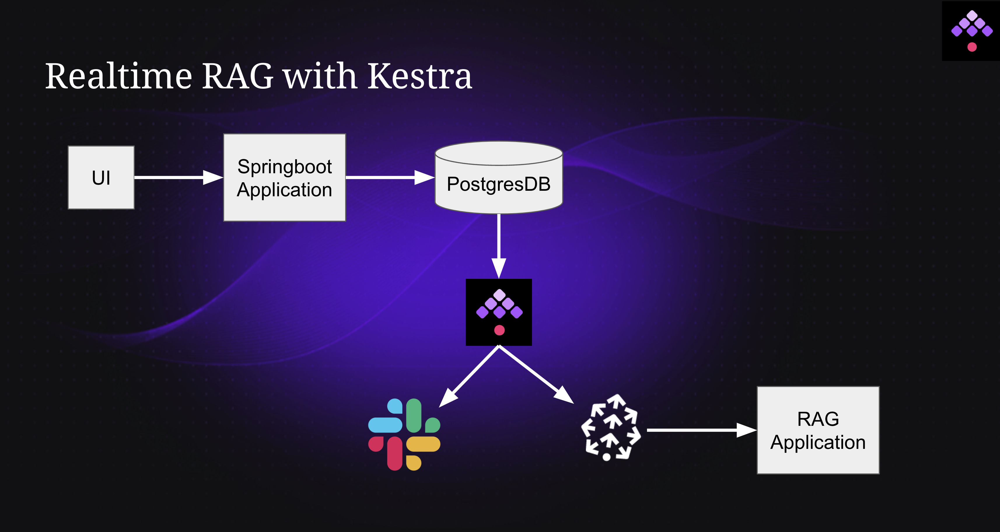

# HackFrost 2024

## Team Details

**Team name:** Frosty Raiders

**Team members:**
- Shruti Mantri
- Amit Bhave
- Piyush Mantri

## Project Details

**Project name:** Realtime RAG with Kestra

The idea is to have realtime RAG that continuously ingests the review data and starts providing generative answers based on the latest data.

The project consists of the following components:

**UI**: The UI mainly consists of two tabs:

1. Posting a review: You can post the review for a product via this tab.
2. Find a review: Given a review ID, you can get the details about a review. This is required so that appropriate action can be taken on a profane review.

**Springboot Applicaiton**: This application powers the UI, and mostly plays the role of a CRUD layer for "reviews" Postgres table.

**Postgres DB**: The database contains the data for these tables:

- Customers
- Products
- Reviews

**Kestra**: This component is at the heart of the project. We have 2 Kestra flows:

1. Setup flow: This is a flow to be run at the starting of the project. This flows sets up the following:

- Creates all the Postgres tables
- Loads the data into customers and products tables
- Creates the pinecone index

2. Main flow: Main flow is based on the Postgres Debezium trigger. Once triggered, the flow logs the review data that has been posted. Then it joins the `product_id` in the review data with the products table to get complete information about the product. From here, the flow branches out in parallel. One branch writes out the embeddings data in Pinecone, while the other does a profanity check on the review. If the review is profane, a message is sent out on Slack via webhook.

**Pinecone**: This is the vectore database where the embeddings for the reviews are stored. This database powers the RAG application.

**RAG Application**: You can query about the reviews via this application. The application responds to the query in a generatibve fashion making it pretty user-friendly.
